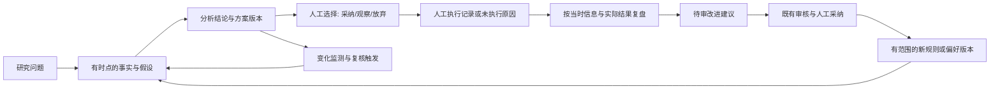

# Agent 协作与决策入口优化方案

> 日期：2026-09-08；基准：当前工作区，HEAD=b21ac8a，包含已有未提交修改。
> 性质：代码静态分析与优化建议，未修改业务代码，未验证生产运行或投资收益。
> 目标：推理有证据、交接有契约、决策有版本、执行有反馈，让系统成为个人股票研究的首选入口。
> 与《决策可信度专项整改方案》的关系：承接已有整改，重新核验当前缺口；已实现的计划版本、推理历史和取消栅栏不重复立项。

## 1. 总体判断

系统已具备股票研究全生命周期的主体能力：市场研判、发现候选、评分、建仓规划、持仓监控、卖出建议、复盘和治理。LangGraph、统一模型上下文、只读工具、审核与前端均有实际承载。

当前最影响目标的是三个连接问题：

1. Agent 之间能交接结果，但对“哪一次分析、哪个时点、哪版证据”的约束不一致。
2. 系统能保存解释，但部分解释记录没有绑定原始输入；复盘与后续学习仍有错误归因风险。
3. 页面能展示功能，但研究问题、分析任务、个人选择和后续验证没有形成统一的连续档案。

建议以“同一决策对象的生命周期”为主线增强现有单体架构。自用系统当前更需要一致的业务契约；拆微服务、增加总指挥 Agent 会额外引入时序、成本和故障处理负担。

这里的“自主”适合体现为自主搜证、识别分歧、补查和复核。交易执行、正式规则及长期偏好变更继续保留既有人工与审核边界。

## 2. 已有基础与耦合判断

| 层面 | 当前基础 | 工程判断 |
|---|---|---|
| 业务编排 | `graph/graphs.py:18`、`graph/router.py:254` 已组织业务节点及 Discover→Score→Position | 显式上下游依赖有价值，应增强交接契约 |
| 协作治理 | `system_map/collaboration.py:150`、`services/chat_handlers.py:34` 有运行时检查 | 地图已有事实源，但执行覆盖与元数据约束未完全对应 |
| 上下文 | `agents/common.py:286` 统一组装规则、偏好、知识、经验、市况 | 代码复用好；所有角色共享默认注入造成较强的行为耦合 |
| 决策历史 | `db/models.py:179` 有计划替代关系，`:297` 有推理追加历史 | 已能保留版本；输入证据及上下游版本绑定仍需补齐 |
| 计划与实盘 | `db/models.py:200` 的持仓关联计划；`review.py:59` 优先读取绑定计划 | 是连续档案的可靠起点，应复用 |
| 运行约束 | `services/task_queue.py:36`、`:65` 有 attempt 与提交栅栏 | 核心机制存在，重点补线程和入口覆盖 |
| 学习治理 | active/shadow 隔离、待审建议、经验生命周期和 T+N 验证均有代码 | 正式治理路径较完整，需收口旁路反馈和证据强度 |
| 产品入口 | React 有市场、候选、计划、持仓、复盘、对话；飞书有意图路由 | 能力足够做统一入口，连续性和状态真实性更紧迫 |

**最需要降低的是隐式语义耦合。** 同读一条“最新”结果、共享全局最后一条反馈、把其他 Agent 的判断当成事实，都可能使代码看起来独立，行为却彼此牵动。

**需要保留的是有解释的依赖。** Score 为 Position 提供研究判断，持仓绑定采用的计划，Review 核对实际执行，这些依赖本身是闭环所需。

## 3. 当前高优先级缺口

以下“已确认”指静态调用链可见；风险场景用于说明触发条件，不代表已观察到线上事故。

### 3.1 P1：历史复盘混入交易结束后的信息

证据：[review.py](D:/self/backend/app/agents/review.py:59) 已绑定计划，但 `:63` 仍读最新评分，`:66`、`:91` 按股票代码取告警和卖出建议；`:98` 拉行情到系统今天，`:101` 仅限定入场之后，`:107` 把最后收盘价称为退出日收盘价。

场景：9 月补录 8 月清仓，后续行情和新评分可能参与评价当时决策，甚至混入同一股票下一轮操作。退出日期从 API 传入本身正确，缺口在事实采集范围。

建议：以实际交易周期和信息截止时间采集；评分绑定入场快照，告警与卖出记录绑定持仓或明确时间范围。退出后的走势另列“事后观察”，不用于倒推当时理应知道什么。

风险与缓解：旧记录缺少关联时不能伪造精确绑定；明确标记推断来源和证据不足，沿用现有入场日前计划回退模式。

效果与复用：复盘能区分判断失误、执行偏差和后续新信息；同一时点契约也能用于历史重跑、Sell 和 T+N 验证。

### 3.2 P1：待审之外存在直接影响评分的软反馈通道

证据：[review.py](D:/self/backend/app/agents/review.py:235) 立即保存 `output.feedback`；[repo.py](D:/self/backend/app/db/repo.py:1354) 递增偏好版本而无审核状态检查；[score.py](D:/self/backend/app/agents/score.py:250) 直接注入最新反馈。

这不是直接修改硬规则。其影响来自提示词里的软偏好：`review_prompt.py:28` 示例包含提高关注权重、降低估值容忍度，足以改变后续判断。确证使用者为 Score，不能仅凭旧注释扩展为所有 Agent。

建议：复盘反馈先作为来源明确的待审建议保存，复用 AgentSuggestion 或经验治理的适用路径；只有通过既有审核与人工采纳要求的行为变更，才进入生效偏好。驳回、撤回必须同步影响可注入状态。

风险与缓解：原有自动适应速度会下降；保留原始观察供查阅，将“记录观察”和“改变行为”分别处理，不删除历史。

效果与复用：任何一次评分风格变化都能追到来源、范围、审核和生效版本；后续新增 Agent 复用同一采纳入口。

### 3.3 P1：并行子任务丢失取消发布约束

证据：[task_queue.py](D:/self/backend/app/services/task_queue.py:36) 以 ContextVar 保存 attempt，`:45` 在无上下文时放行；[router.py](D:/self/backend/app/graph/router.py:288)、`:317` 使用普通线程池，没有传播上下文。

场景：候选达到并行门槛后取消或重试任务，评分、计划子线程仍可能通过提交栅栏发布结果，形成“任务已取消，结果后来又变了”。

建议：每个子任务单独传播上下文，阶段入口和业务提交检查发布资格；区分合法同步调用与后台任务。跨入口生成同标的结果时，还应明确版本和发布顺序。

风险与缓解：共享同一个 Context 并发运行会出错，应按子任务复制；测试覆盖并行阻塞→取消→放行→不得提交，同时保留正常人工同步路径。

效果与复用：任务状态与结果一致；同一封装供评分、建仓等线程池复用。

### 3.4 P1：首页把未知状态转成否定或正常

证据：[dashboard.py](D:/self/backend/app/services/dashboard.py:45) 读取当日已存结果，`:54` 异常返回零；[OverviewPage.tsx](D:/self/web/src/pages/OverviewPage.tsx:340) 显示“今日无可建仓标的”。同页 `:230` 起将缺少价格或红线信息的持仓落入未触发分支，`:238` 可显示正常。

建议：统一 `ready/pending/stale/error`、数据截止时间和检查覆盖度。未计算与计算后为零分别显示；风险未完成检查时应呈现未知。

风险与缓解：页面可能出现更多“待更新”，但这是已有信息缺口；用可恢复任务和最近有效结果降低操作负担，参考该页已有盈亏缺失状态处理。

效果与复用：用户能知道哪些结论可以依赖；状态契约同时适用于候选、持仓、市场和每日简报。

## 4. 协作和推理闭环的结构性改进

### 4.1 用同一时点、同一版本交接

当前 [router.py](D:/self/backend/app/graph/router.py:125) 根据已有评分决定建仓资格，而 [position.py](D:/self/backend/app/agents/position.py:33) 随后重新读取最新评分。门槛检查与实际规划可能使用不同版本；历史重跑也不能默认使用今天的最新数据。

建议在现有 state、结果 detail 与历史记录中先加入小型交接结构，不先铺开大量新表：

| 字段 | 含义 |
|---|---|
| analysis_id / attempt_id | 一次研究任务与本次执行尝试；重试不能冒充原结果 |
| result_id / parent_result_ids | 当前结果与实际消费的上游版本 |
| subject / holding_id | 股票或主题，以及适用的交易周期 |
| as_of / data_cutoff / valid_until | 研判时点、数据截止、适用有效期 |
| input_snapshot_ref / input_hash | 可取回的输入证据与完整性指纹 |
| policy_versions | 模型、提示词、规则、偏好和实际注入知识版本 |
| status / missing_inputs | 成功、部分完成、失败或不适用，以及缺失依据 |

名称为建议，实施时优先映射现有字段。Position 已有 `data_as_of/analysis_generated_at/input_fingerprint`，见 [position.py](D:/self/backend/app/agents/position.py:149)，适合作为推广起点。

原始数据需区分发生时间、发布时间、系统获取时间，保留价格复权口径和数据来源。只存一个日期不足以证明历史分析没有读取未来信息。

缓存只对相同有效输入复用。[score.py](D:/self/backend/app/agents/score.py:272) 的单发评分键主要包含股票、日期和游资指纹；common 的治理版本无法替代新闻、行情和市况快照版本。此风险主要针对普通单发及 ReAct 回退路径，不能概括为所有评分都复用整日缓存。

### 4.2 让角色按证据协作，保留分歧

建议明确现有角色的交付责任：

| 角色 | 应回答的问题 | 应交给下游的内容 |
|---|---|---|
| MarketIntel / 行业能力 | 当前环境支持哪类机会，哪些信息尚不确定 | 有截止时间的环境判断及原始依据 |
| Discover | 为什么这只股票值得研究 | 候选假设、证据引用、主要反证 |
| Score | 原假设是否得到支持，在哪些维度不成立 | 独立因子判断、冲突项、缺失数据 |
| Position | 在当前账户约束下，何时、以何种条件考虑参与 | 条件化方案、风险约束、失效条件 |
| Monitor / Sell | 原假设或风险状态发生了什么变化 | 变化证据、触发原因、建议及适用期限 |
| Review / Audit | 当时判断和实际执行各有什么问题；什么建议可被采纳 | 可归因复盘与受治理的变更建议 |

不要把“多个 Agent 说法一致”当作多份独立证据。相同数据、模型和提示词可能造成共同偏差。

[common.py](D:/self/backend/app/agents/common.py:322) 对所有调用注入阶段经验，未知角色默认落入选股阶段；`:341` 为各角色注入最新市场研判。[audit.py](D:/self/backend/app/agents/audit.py:30) 也走默认组装路径。市场研判自身重跑同样可能读入旧研判。

建议为已有上下文组装器提供角色策略：业务 Agent 取有范围的历史参考；Audit 使用待审证据和适用规则；市场重评把上一版作为明确标注的对比对象。先展示实际注入清单，再逐步约束范围，降低一次改动引起的行为漂移。

处理分歧时先判断原因：数据时点不同、方法不同、期限不同，还是账户约束不同。只有同一对象、时点、期限和目标下的判断才适合比较。

可执行的冲突策略：硬约束冲突进入不可行动状态；关键信息不足进入待补证；主观分歧保留双方依据，由明确的决策责任角色形成条件化建议。权限检查和风险校验由代码保证，不依赖额外一次模型投票。

### 4.3 把解释升级为可验证的证据记录

[reasoning_trace.py](D:/self/backend/app/services/reasoning_trace.py:239) 的 Score `fact_basis` 保存模型输出 detail，`:262` 的 Plan 保存输出批次；相关 `rule_refs` 为空。已有历史可以回看多版解释，但部分字段并未保存产生判断时的事实输入。

建议保留现有历史表，先为 Score→Plan→Holding→Sell→Trade→Review 绑定实际输入快照和结果版本。事实引用至少能定位数据源、时间、数值及口径，推断指向所用事实。

一条研究结论至少回答六件事：**结论是什么、证据是什么、依赖什么假设、什么情况会推翻、何时复核、适用什么范围。**

例如“行业催化持续时保留观察；订单兑现不及预期则原假设失效”，必须把催化和订单证据关联到真实公告。该例仅说明输出结构，不作为新增交易规则。

解释文本和模型思考摘要不能单独证明推理正确。验收应看引用可解析、时间不越界、数值可重算、条件可观察、变更可归因，而非解释长度。

留痕目前是内存队列异步写入，[reasoning_trace.py](D:/self/backend/app/services/reasoning_trace.py:54) 失败不阻塞业务。若目标要求关键决策必有证据，需把最小审计记录与业务结果同事务保存，长文本再异步补全；避免进程退出导致结果存在而证据永久缺失。

### 4.4 让评分计算与经验学习的证据强度匹配

[schemas.py](D:/self/backend/app/agents/schemas.py:161) 已强校验六因子数量和名称，应保留；但综合分、评级和因子之间尚无完整一致性校验。

[score_prompt.py](D:/self/agent_prompts/score_prompt.py:43) 允许权重侧重变化，`:68` 允许汇总后微调。因此不能在普通修复中擅自换成固定公式。

建议先显式保存实际使用的权重、调整项和方法版本，并验证可重算一致性；如要改变权重或评级方法，单独进入现有审核与验证流程。

[track_verify.py](D:/self/backend/app/services/track_verify.py:49) 高低组各 3 个样本即可比较，`:535` 用胜率差标有效或失效，`:664` 将适当降权提示送入评分。这样的观测适合发现待研究问题，尚不足以支持稳定预测力结论。

建议区分观察与验证：展示样本数、观察窗口、市场状态、区间估计；使用成熟 T+N 样本，做按时间留出的检验，处理同日同板块样本相关性。收益评估考虑基准、费用、可成交性以及未采纳标的，避免只评价成功交易。

置信度需对应明确事件和期限，再检查历史可靠性；模型自报 high 不能直接解释为高胜率。对多因子、多阈值反复试验应记录试验版本，避免挑选最好结果。

### 4.5 收口执行边界和部分失败

协作检查目前主要在显式携带 `_caller_agent` 的 handler 路径，见 [chat_handlers.py](D:/self/backend/app/services/chat_handlers.py:34)。固定流水线与直接 graph 调用不能简单视为越权，但需要显式记录“人工发起、系统编排、Agent 发起”的来源。

建议在现有 router/dispatcher 统一记录来源、父调用、关系、深度和检查结论。先完整盘点合法链路，再使矩阵中的深度与冲突政策可执行，防止误拦现有 Position 补评分。

[router.py](D:/self/backend/app/graph/router.py:281) 单股失败被捕获，流水线仍可正常返回；[task_queue.py](D:/self/backend/app/services/task_queue.py:156) 随之标记 done。建议输出逐标的 success/failed/skipped 与总状态 partial，并支持只重试失败项。

这样“没有机会”“尚未评分”“评分失败”才有不同含义，也能直接供首页使用。

## 5. 让系统成为第一入口

### 5.1 产品主线：今天要处理什么，上次判断现在怎样

建议把首页改为日常决策工作台，优先复用 [dashboard.py](D:/self/backend/app/services/dashboard.py:75) 已聚合的告警、计划、复盘和建议：

1. 今日需处理：持仓假设失效、方案过期、重要证据变化、待补研究和待复盘。
2. 我的股票与主题：上次结论、当前状态、变化原因、下一复核条件。
3. 统一研究输入：输入股票、新闻或问题，进入对应研究档案和已有工作流。

每项直接连接证据和下一步操作；系统运行指标放在需要排障的位置。盘前回答关注什么，盘中只提示有意义的变化，盘后回收执行记录与待验证问题。

“观察”“放弃”“暂不行动”都是合法结果。粘性目标是降低决策和续接成本，不用更多交易、更多告警或更长停留时间作为成功指标。

### 5.2 连续研究档案

同一股票可以有长期研究档案，但每轮假设、方案和持仓周期必须分别标识，避免跨周期污染。

档案围绕以下链路组织：

档案默认展示“上次结论→发生了什么→现在结论→下一步”。展开后才显示专业 Agent 明细和完整证据。

阅读完成、采纳建议、实际成交和验证有效分别记录；用户未录入实际操作时，系统应保留未知，不能推测已按建议执行。

### 5.3 统一 Web 与飞书入口，恢复跨天续接

[routes.py](D:/self/backend/app/api/routes.py:1950) 的 Web 对话请求只有 agent/question；[agent_chat.py](D:/self/backend/app/services/agent_chat.py:313) 构造本次问题上下文，`:349` 保存历史，但该路径不读回研究会话。

[feishu_bridge.py](D:/self/backend/app/services/feishu_bridge.py:111) 已接入意图路由和执行；可把现有 router/dispatcher 提炼为共用入口，让 Web 也使用注册工作流和执行门禁。手动选择专家 Agent 保留为高级功能。

对话需绑定研究对象、未解决问题、关联任务和受控摘要，不能直接把所有历史全文当成长期记忆。用户事实、模型猜测和历史结论分别标注来源与有效期。

[AgentChatPage.tsx](D:/self/web/src/pages/AgentChatPage.tsx:110) 的待确认、已完成和归档主要存 localStorage；`:22` 的当前异步任务也在组件状态。可先复用已有 `useTaskSubmit.ts:24` 和任务 store，再将研究会话、任务和用户选择持久关联，支持刷新、切页和跨设备续接。

## 6. 建议按三批推进

每批最多两轮 review→修改；本方案不附执行提示词，后续每批以本节和相关小节为引用拆出。

| 批次 | 目的与范围 | 最小交付与验收 |
|---|---|---|
| 1：可信基础 | §3 的复盘时点、反馈审核、并行取消和首页未知状态 | 历史复盘不读退出后信息；未采纳反馈不影响评分；并行取消不发布；未知不显示正常或零机会 |
| 2：决策连续性 | §4.1、§4.3、§4.5 的版本交接、证据绑定和部分完成；§5.2 最小档案 | 从一条计划找回采用的评分与事实；同日重算可解释差异；人工选择与交易可关联；失败项可续跑 |
| 3：入口与验证 | §5.1、§5.3 的共用入口、待处理事项、会话恢复；§4.4 先落观察与证据展示 | 不先选 Agent 也能分析；跨天续接；提醒有变化依据；方法调整继续按既有独立审核流程推进 |

每批先选一条真实使用链路验收，例如“研究一只股票→生成方案→人工选择观察→证据变化→复核→记录决定”。逐步扩展，而不是一次迁移所有 Agent。

## 7. 验收指标

以下是建议采集的指标，尚无实测基线，不设凭空的通过率。

| 维度 | 指标 |
|---|---|
| 可追溯 | 抽样决策能否还原当时输入、方法版本、上游结果和采用记录；缺失明确标识 |
| 时间正确 | 历史复盘中超出当时可获知范围的数据引用数；关键边界要求为零 |
| 治理正确 | 未审核行为反馈注入数、取消后业务发布数、shadow 正式注入数；要求为零 |
| 一致性 | 结论与引用是否匹配、同版输入的数值能否重算、决策变更能否归因 |
| 连续性 | 离开后能否恢复任务与研究问题；进入证据和下一操作所需步骤 |
| 提醒质量 | 可解释的有效变化比例、重复提醒率、用户处理及搁置原因 |
| 研究质量 | 成熟样本上的校准、基准对照、执行偏差；区分样本观察与验证结论 |
| 入口粘性 | 用户产生股票研究需求时优先进入系统的比例，以及未决问题的续接完成率 |

## 8. 初始分析交付与边界

- 初始分析阶段只新增本方案，未修改业务、提示词、账户数据或现有未提交文件。
- 初始分析阶段未运行测试，结论来自静态代码核验；后续落地批次的实际验证记录见 §9、§10。
- 未访问实时账户或评估真实收益；首屏速度、生产发生频率和个人使用习惯仍待实际验证。

逐条治理红线核对（针对本次操作与建议）：

1. 自动交易和下单：未引入；建议保留人工执行。
2. Agent 擅自修改规则、偏好、知识或记忆：未执行；已指出软反馈旁路，应收口至既有门禁。
3. Shadow 进入正式提示词或评分：未引入。
4. 经验成为硬规则：未引入；强调观察、证据强度与适用范围。
5. 局部经验扩大到全体 Agent：未引入；建议收紧默认注入范围。
6. RuleChange 扩大注入范围：未引入；保留 target_agent/all/存量兼容边界。
7. ReAct 工具写业务、审批、推送或交易：未引入；建议复用只读工具与正式执行入口。
8. Shadow、摘要或低置信记忆自动转正：未引入；统计观察不自动升级为方法规则。
9. 物理删除记忆：未执行；建议保留来源、归档和失效记录。
10. 以 README 代替现有代码事实：未采用；重点结论均核查当前代码路径。

系统下一阶段最有价值的体验是：用户随时能查清“我原来为什么这样判断，后来什么变了，现在要不要重新判断，以及这个判断后来怎样了”。工程一致性与入口粘性应围绕这一条链共同建设。

## 9. 本轮连接问题修复

本轮针对“候选池、验证、审核和页面状态彼此断开”落地了最小连接：

1. `graph/router.py:88` 的 Discover 在确实产生候选后调用 `track_verify.register_new_candidates()`；只建立幂等追踪行，不提前计算收益。这样当日新候选会立即出现在选股效果验证中，T+N 未到期仍显示为空。
2. `ReviewsPage.tsx:879` 起的 T+N 验证、历史回填和建议生成改走 `useTaskSubmit`；任务进入全局任务面板，完成后再刷新日期、追踪行和待审建议，失败可由统一任务面板处理。
3. `SystemMapPage.tsx:453` 起的治理卡片提供直接入口：规则建议进入 `/reviews?tab=sug`，影子验证进入 `/reviews?tab=track`，高影响经验进入 `/experience?tab=M3`。`ReviewsPage` 和 `ExperiencePage` 支持查询参数直达对应页签。
4. `RuleChangesPage.tsx:202` 与复盘建议页均提供“增量 AI 审核”。数量来自待审 `AgentSuggestion`，不是已落地 `RuleChange`；文案明确使用现有审核游标的增量语义，不宣称历史全量重扫。
5. 系统治理页、工具字段、经验扩展字段和审核详情增加中文主标签，内部 key 仅作为悬停提示或次级信息；审核状态统一显示为待审核、通过、未通过等中文。

本轮验证：前端 `npm run build` 通过；`backend/tests/test_track_verify.py` 为 26 passed、1 warning。未运行实时行情、LLM、账户或交易操作。已有工作区的其他未提交修改保持不动。

## 10. 本轮可信闭环补强

在上一节的入口连接基础上，本轮继续落地三项 P1 修复：

1. 复盘事实包绑定持仓生命周期。`ReviewAgent` 以首次建仓日到最后卖出日作为窗口，流水、告警、卖出建议、游资留痕和 K 线均在窗口内；评分只读取入场日及之前的最新版本。复盘任务的业务 `exit_date` 取实际卖出流水，不再使用任务提交当天；当前组合曲线无法按历史时点重建时明确返回缺失状态。
2. 复盘反馈先进入 `AgentPreference.status=pending`，评分上下文只读取 `active` 版本。旧复盘采纳入口和 profile 类建议的人工审批会激活对应版本，驳回会标记为 `rejected`；历史库通过增量迁移默认保留为 active，避免升级后改变既有人工偏好。
3. 后台任务的并行评分、建仓线程逐个复制当前 `attempt` 上下文。取消、超时或重试后，旧线程在提交业务结果时会被栅栏拒绝，任务状态与业务落库不再分离。

这三项修复的共同边界是：没有引入自动交易、没有让 Agent 绕过人工审核改变规则，也没有把 shadow 或未审核反馈注入正式决策。新增验证覆盖复盘时间窗口、偏好状态迁移、人工采纳激活以及并行取消/重试后的业务写入隔离。

本轮定向验证：`test_review_temporal_scope.py`、`test_review_suggestion_loop.py`、`test_task_guard.py` 合计 26 passed；`test_plan_gate.py`、`test_track_verify.py` 合计 37 passed；生命周期、游资复盘、数据库和开仓绑定相关测试 28 passed；`compileall` 和 `git diff --check` 通过。测试环境提示 Python 3.14 与 Pydantic V1 的既有 warning，不影响结果。
